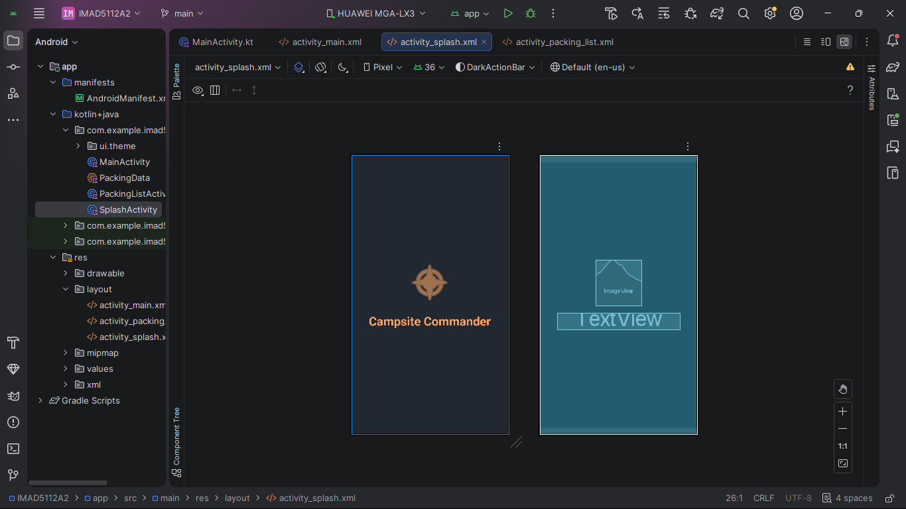
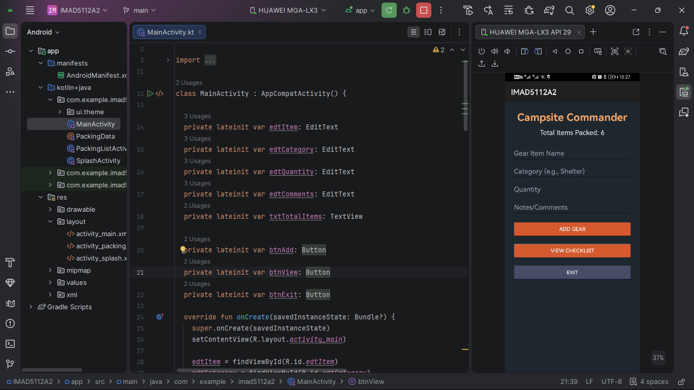
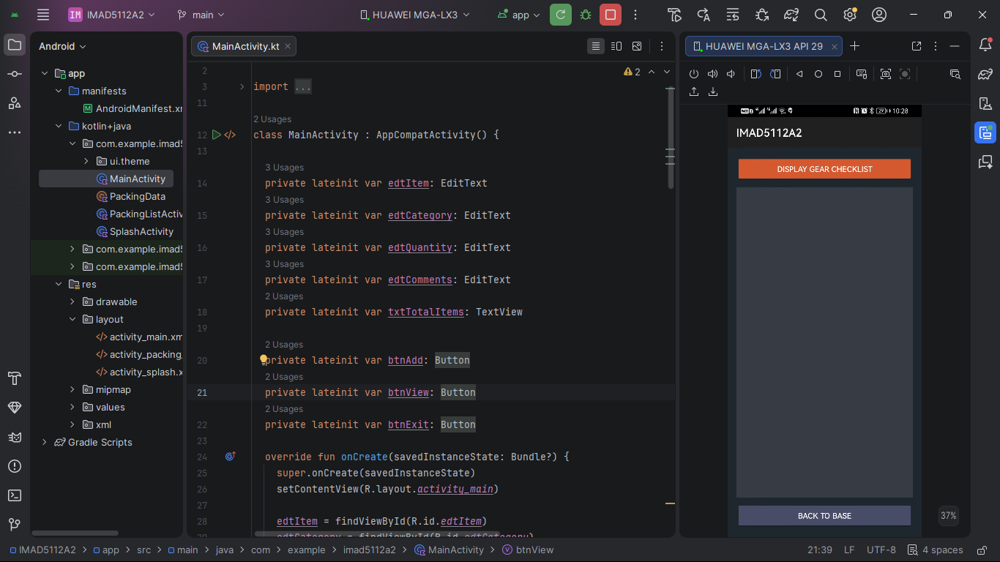
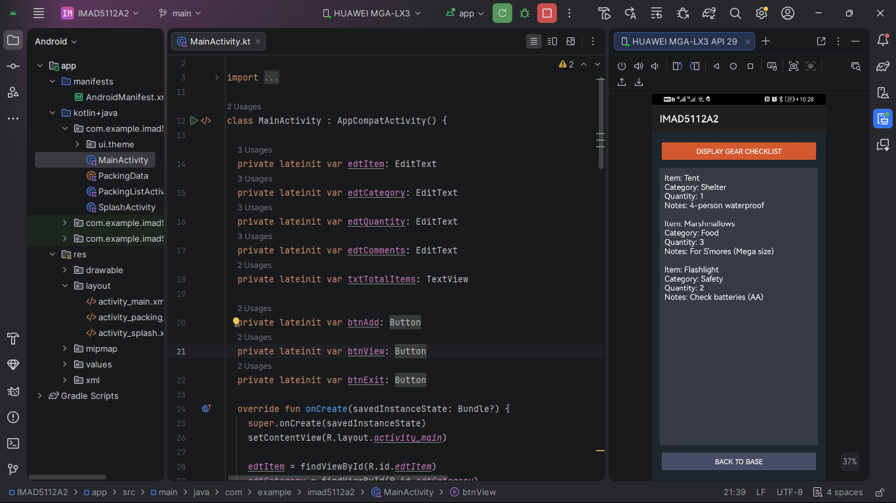

# Campsite Commander (IMAD5112A2)
A native Android inventory app built with Kotlin in Android Studio, designed for outdoor adventures. 

Keep track of your camping gear and food supplies, categorize your outdoor essentials (e.g., Shelter, Cooking, First Aid), and ensure you are fully prepared for your next trip to the great outdoors! 

The app safely stores these entries using parallel arrays, calculates the total items packed using loops, and provides a detailed, scrollable checklist view of your gear.
## Author
### Hlengani Nhlangano Cherish
### ST10526531

## Features

* **Splash Screen:** A 3-second nature-themed loading screen welcoming users to the app.
* **Main Command Screen:** The control center for adding new gear, featuring:
    * Input fields for Gear Item Name, Category, Quantity, and Notes/Comments.
    * A dynamic **Total Items Packed** display that accurately calculates total gear quantities.
    * An **Add Gear** button with robust error handling (prevents blank fields, prevents zero/negative quantities, and respects a 20-unique-item maximum limit).
    * A nature-themed "Dark Mode" color palette.
* **Checklist View Screen:** A detailed display screen providing the full list of packed gear, complete with categories, quantities, and user notes. Includes a **Back To Base** navigation button for smooth screen transitions.

---

## Screenshots

### Splash Screen

###  Main Screen

###  Detailed Checklist View

---
